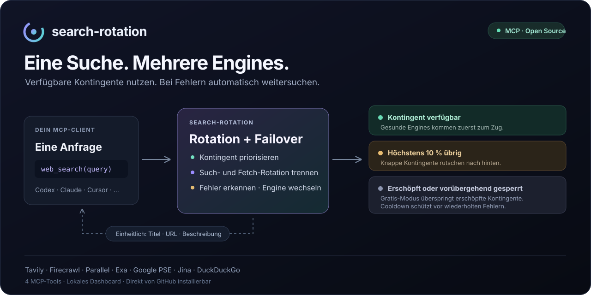

<div align="center">

# search-rotation

**Eine Websuche für deinen MCP-Client. Mehrere Engines im Hintergrund.**

[](https://github.com/RobinBially/search-rotation/actions/workflows/ci.yml)
[](https://github.com/RobinBially/search-rotation/releases/latest)
[](https://nodejs.org/)
[](LICENSE)

[Loslegen](#in-zwei-minuten-startklar) · [MCP-Clients](#mit-deinem-mcp-client-verbinden) · [Engines](#unterstützte-engines) · [Releases](https://github.com/RobinBially/search-rotation/releases)

</div>



`search-rotation` verbindet **Tavily, Firecrawl, Parallel, Exa, Google PSE, Jina und DuckDuckGo** hinter vier MCP-Tools. Suche und Seitenabruf rotieren unabhängig. Bei einem Ausfall versucht der Server die nächste verfügbare Engine und nennt den Wechsel im Ergebnis.

Im lokalen Dashboard verwaltest du API-Keys, sortierst Engines per Drag-and-drop, prüfst Kontingente und siehst den Verlauf. **Installation direkt von GitHub — kein npm-Account nötig.**

| Für deinen Agenten | Für dich |
|---|---|
| Einheitliche Suchtreffer mit Titel, URL und Beschreibung | Dashboard mit Übersicht, Engine-Verwaltung und Verlauf |
| Webseiten als Markdown | Search und Fetch je Engine getrennt testen |
| Failover, Cooldowns und Abbruchweitergabe | Kontingentquelle, Zeitraum und Schätzstatus sichtbar |
| MCP über stdio oder Streamable HTTP | Optionaler Gratis-Modus, Dark/Light Theme und mehrere Sprachen |

## In zwei Minuten startklar

Voraussetzung: **Node.js ab 20.3** mit npm/npx und Git. Empfohlen ist eine aktuelle LTS-Version.

```sh
npx -y --allow-git=all github:RobinBially/search-rotation#v0.3.0
```

Damit startest du den stdio-MCP-Server. Für einen ersten Blick auf das Dashboard ohne angeschlossenen MCP-Client:

```sh
npx -y --allow-git=all github:RobinBially/search-rotation#v0.3.0 --http --open
```

1. Dashboard öffnen — standardmäßig **http://127.0.0.1:6277**. Ist der Port belegt, steht die tatsächlich verwendete URL im Log.
2. Unter **Engines** API-Keys hinterlegen und die gewünschte Reihenfolge einstellen.
3. Deinen MCP-Client wie unten konfigurieren und eine Websuche starten.

Exa und Firecrawl können ohne Key über IP-Kontingente arbeiten; Jina unterstützt Seitenabrufe ohne Key. Verfügbarkeit und Limits hängen vom Anbieter ab. Eigene Keys ermöglichen planbarere Kontingente.

> npm/npx werden nur für Download und Installation verwendet. **Es gibt keinen npm-Publish und keinen Account-Schritt.** `--allow-git=all` erlaubt den GitHub-Bezug unter npm 12; ältere npm-Versionen können dazu eine Warnung ausgeben. `#v0.3.0` fixiert die Release-Version.

## Mit deinem MCP-Client verbinden

<details open>
<summary><strong>Codex</strong> — <code>~/.codex/config.toml</code></summary>

```toml
[mcp_servers.search-rotation]
command = "npx"
args = ["-y", "--allow-git=all", "github:RobinBially/search-rotation#v0.3.0"]
```

</details>

<details>
<summary><strong>Claude Desktop / Claude Code</strong> — MCP-Konfiguration</summary>

```json
{
  "mcpServers": {
    "search-rotation": {
      "command": "npx",
      "args": ["-y", "--allow-git=all", "github:RobinBially/search-rotation#v0.3.0"]
    }
  }
}
```

</details>

<details>
<summary><strong>Cursor</strong> — <code>.cursor/mcp.json</code></summary>

```json
{
  "mcpServers": {
    "search-rotation": {
      "command": "npx",
      "args": ["-y", "--allow-git=all", "github:RobinBially/search-rotation#v0.3.0"]
    }
  }
}
```

</details>

<details>
<summary><strong>OpenCode V2</strong> — Eintrag unter <code>mcp.servers</code></summary>

```json
"search-rotation": {
  "type": "local",
  "command": ["npx", "-y", "--allow-git=all", "github:RobinBially/search-rotation#v0.3.0"],
  "codemode": true
}
```

</details>

Bereits lokal installiert? `command = "search-rotation"` bzw. `["search-rotation"]` funktioniert weiterhin. Für die aktuellste Entwicklungsversion kannst du den Tag weglassen; für reproduzierbare Installationen einen Release-Tag verwenden.

## Was dein Agent damit kann

| Tool | Aufgabe | Beispiel |
|---|---|---|
| `web_search` | Suchen, optional mit Ergebnisanzahl und bevorzugter Engine | „Finde die wichtigsten Neuerungen von TypeScript.“ |
| `fetch_url` | Eine Webseite als Markdown abrufen | „Lies diese Dokumentation und fasse sie zusammen.“ |
| `engine_status` | Engines, Kontingente und letzte Fehler anzeigen | „Wie viel Suchkontingent ist noch verfügbar?“ |
| `open_dashboard` | Das lokale Dashboard öffnen | „Ich möchte einen API-Key hinterlegen.“ |

**So wird ausgewählt:** Engines mit gesundem Kontingent kommen zuerst, solche mit höchstens 10 % Rest danach. Erschöpfte Engines bleiben die letzte Instanz oder werden im strikten Gratis-Modus vollständig übersprungen. HTTP 429 und wiederholte Fehler lösen eine Pause aus. Ein Gesamtzeitlimit begrenzt die gesamte Such-/Fetch-Kette.

## Unterstützte Engines

| Engine | Suche | Seitenabruf | Zugang | Kontingentanzeige |
|---|:---:|:---:|---|---|
| [Tavily](https://tavily.com) | ✓ | ✓ | API-Key | Remote-Credits |
| [Firecrawl](https://firecrawl.dev) | ✓ | ✓ | API-Key oder kleines IP-Kontingent | Remote-Credits mit Key |
| [Parallel](https://parallel.ai) | ✓ | ✓ | API-Key | Lokal gezählte Requests |
| [Exa](https://exa.ai) | ✓ | ✓ | API-Key oder gehosteter Exa-MCP | Lokale Schätzung / IP-Limit unbekannt |
| [Google PSE](https://programmablesearchengine.google.com) | ✓ | — | API-Key + Search Engine ID; standardmäßig aus | Tagesfenster in Pacific Time |
| [Jina Reader](https://jina.ai/reader) | — | ✓ | Ohne Key möglich | IP-Limit unbekannt |
| [DuckDuckGo HTML](https://duckduckgo.com) | ✓ | — | Ohne Key; inoffizieller HTML-Zugang | IP-Limit unbekannt |

Tarife und Verfügbarkeit können sich ändern. Die Anzeige unterscheidet Anbieterwerte und lokale Schätzungen; unbekannte IP-Limits werden ausdrücklich als unbekannt angezeigt. Der **Gratis-Modus ist keine Abrechnungsgarantie**, insbesondere bei anderen Anwendungen mit demselben Konto. Verbindliche Ausgabenlimits setzt du beim Anbieter.

## Remote nutzen und Einstellungen anpassen

- **Lokal:** Ein Prozess stellt MCP und Dashboard bereit. Konfiguration und Daten liegen in `~/.config/search-rotation/`; API-Keys werden in `config.json` mit Dateirechten `0600` gespeichert.
- **Remote:** Streamable HTTP unter `/mcp`, Bearer-Token, explizite Host-/Origin-Freigabe und Browser-Login über `/login`. Für einen Bind außerhalb von Loopback ist ein Token erforderlich.
- **Im Dashboard:** Engines und Reihenfolge, strikter Gratis-Modus und Gesamtzeitlimit (Standard 60 Sekunden).
- **Beim Update auf v0.3.0:** Alte Serverprozesse vorher beenden. Die Dateien bleiben kompatibel. Im Token-Betrieb ersetzt `/login` die frühere `?token=…`-Anmeldung.

→ **[Betrieb, Remote-Setup und alle Konfigurationsfelder](docs/operations.md)**

## Releases und Entwicklung

Jeder `v*`-Tag durchläuft Tests und Build unter **Node 20, 22 und 24**. Der Release-Workflow erstellt anschließend einen GitHub-Release mit:

- `search-rotation-VERSION.tgz` — fertig gebautes, installierbares Paket;
- `SHA256SUMS` — SHA-256-Prüfsumme zum Prüfen des Downloads;
- Release Notes und automatisch ergänzter GitHub-Änderungsliste.

Alternativ zum Git-Install kannst du das [Release-Paket](https://github.com/RobinBially/search-rotation/releases/latest) herunterladen und lokal installieren:

```sh
npm install -g ./search-rotation-0.3.0.tgz
search-rotation
```

Für die Entwicklung:

```sh
git clone https://github.com/RobinBially/search-rotation.git
cd search-rotation
npm ci
npm test
npm run dev
```

`npm run smoke:package` baut ein Paket, installiert es in einem temporären Verzeichnis und prüft den MCP-Handshake samt aller vier Tools. [CI](.github/workflows/ci.yml) läuft bei Push und Pull Request; [Release](.github/workflows/release.yml) bei Versionstags. Beide benötigen **keine npm-Zugangsdaten**.

---

[MIT-Lizenz](LICENSE) · [Fehler melden](https://github.com/RobinBially/search-rotation/issues) · [Release Notes](https://github.com/RobinBially/search-rotation/releases)
