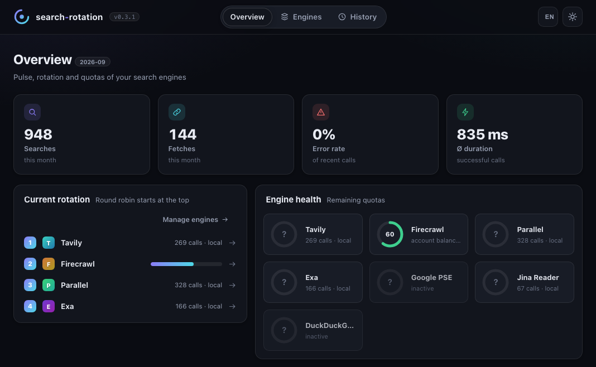

# search-rotation

**One MCP server for web search and page extraction across multiple providers.**

Rotate across available quotas, automatically fail over when a provider is unavailable, and return consistent results to your AI assistant. A local dashboard lets you manage API keys, reorder engines, check quotas, and inspect request history.


*Actual dashboard UI, shown in English with illustrative demo data.*

## Quick start

Requires **Node.js 20.3+** and **Git**. Install directly from GitHub — **no npm account needed**.

```sh
npx -y --allow-git=all github:RobinBially/search-rotation#v0.3.1
```

To preview the dashboard:

```sh
npx -y --allow-git=all github:RobinBially/search-rotation#v0.3.1 --http --open
```

Add your provider keys in the dashboard, then connect your assistant using the **[MCP client setup guide](docs/clients.md)** for Codex, Claude, Cursor, or OpenCode.

## What you get

- **Search and fetch:** independent rotation for web search and Markdown page extraction.
- **Automatic failover:** quota-aware ordering, rate-limit cooldowns, and request timeouts.
- **Local dashboard:** API keys, drag-and-drop engine order, quota status, and request history.
- **Local or remote:** MCP over stdio or authenticated Streamable HTTP.

**Providers:** Tavily · Firecrawl · Parallel · Exa · Google PSE · Jina Reader · DuckDuckGo HTML. [Keyless access and quota accounting](docs/provider-access.md) vary by provider.

**MCP tools:** `web_search` · `fetch_url` · `engine_status` · `open_dashboard`.

## Learn more

[Client setup](docs/clients.md) · [Operations & configuration (DE)](docs/operations.md) · [Releases](https://github.com/RobinBially/search-rotation/releases) · [CI](https://github.com/RobinBially/search-rotation/actions/workflows/ci.yml) · [MIT license](LICENSE)
