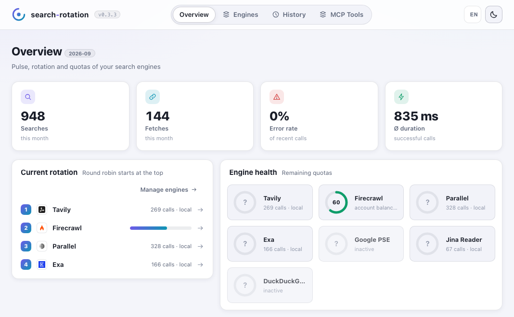
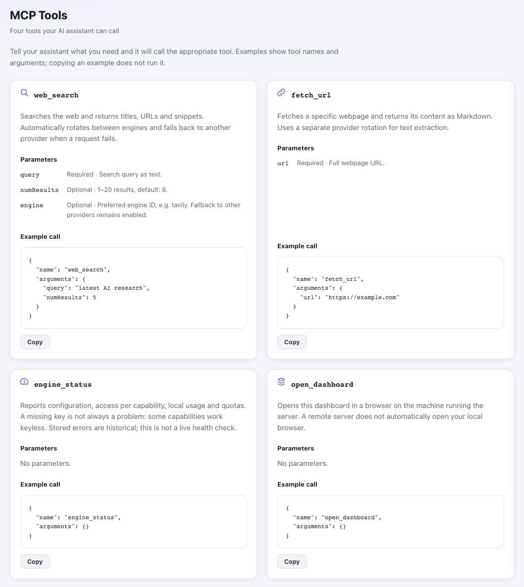

<picture>
  <source media="(prefers-color-scheme: dark)" srcset="docs/assets/brand/wordmark-dark.svg">
  
</picture>

**One MCP server for web search and page extraction across multiple providers.**

Built by [Robin Bially](https://github.com/localfoundry) under the LocalFoundry label.

Rotate across available quotas, automatically fail over when a provider is unavailable, and return consistent results to your AI assistant. A local dashboard lets you manage API keys, reorder engines, check quotas, and inspect request history.

<picture>
  <source media="(prefers-color-scheme: dark)" srcset="docs/assets/dashboard-dark.png">
  
</picture>

*Actual dashboard UI, shown in English with illustrative demo data. Calls and provider budgets are displayed separately; activity bars offer time-window and per-engine details.*

## Quick start

### npm

```sh
npx -y search-rotation --http --open
```

Requires **Node.js 20.3+**. For MCP over stdio, configure your client to run
`npx -y search-rotation` with no arguments. The server is also listed in the
[official MCP Registry](https://registry.modelcontextprotocol.io/?q=io.github.localfoundry%2Fsearch-rotation)
as `io.github.localfoundry/search-rotation`.

### Homebrew

```sh
brew install localfoundry/tap/search-rotation
search-rotation --http --open
```

Homebrew installs the required Node.js runtime. For MCP over stdio, configure your
client to run `search-rotation` with no arguments. See the
[LocalFoundry tap](https://github.com/localfoundry/homebrew-tap) for upgrades and details.

### Pinned release from GitHub

```sh
npx -y --allow-git=all github:localfoundry/search-rotation-mcp#v0.4.10
```

Use this when you want a fixed version instead of the current npm release.

Add your provider keys in the dashboard, then connect your assistant using the **[MCP client setup guide](docs/clients.md)** for Codex, Claude, Cursor, or OpenCode.

## What you get

- **Search and fetch:** independent rotation for web search and Markdown page extraction.
- **Automatic failover:** quota-aware ordering, rate-limit cooldowns, and request timeouts.
- **Local dashboard:** API keys, drag-and-drop engine order, per-engine calls and errors, separate quota balances, and interactive request history.
- **Local or remote:** MCP over stdio or authenticated Streamable HTTP.

**Providers:** Tavily · Firecrawl · Parallel · Exa · Google PSE · Jina Reader · DuckDuckGo HTML. [Keyless access and quota accounting](docs/provider-access.md) vary by provider.

## MCP tools

`web_search` · `fetch_url` · `engine_status` · `open_dashboard`

The dashboard's **MCP Tools** tab explains each tool, its parameters, and copyable example calls.

<picture>
  <source media="(prefers-color-scheme: dark)" srcset="docs/assets/mcp-tools-dark.png">
  
</picture>

*Actual dashboard UI, shown in English.*

## Search time filters

`web_search` accepts the following arguments:

| Parameter | Meaning |
| --- | --- |
| `query` | Required search text. |
| `numResults` | Optional result count, 1–20; otherwise the dashboard setting applies. |
| `engine` | Preferred provider, subject to time-filter support and availability; failover stays enabled. |
| `timeRange` | `day`, `week`, `month`, or `year`: UTC date window starting 1, 7, 30, or 365 days ago, through today. |
| `startDate` | Optional lower date bound in `YYYY-MM-DD` format. |
| `endDate` | Optional upper date bound in `YYYY-MM-DD` format. |

Use either `timeRange` or explicit dates. One-sided bounds and equal start/end dates are allowed; invalid calendar dates, reversed bounds, and mixing relative and explicit filters are rejected before any provider request.

```json
{"name":"web_search","arguments":{"query":"AI inference research","timeRange":"week","numResults":5}}
```

```json
{"name":"web_search","arguments":{"query":"AI inference research","startDate":"2026-08-01","endDate":"2026-08-31"}}
```

Relative windows are resolved **once per request** into UTC dates, including across failover. These are date filters, not exact rolling 24-hour windows; `month` and `year` mean 30 and 365 days, not calendar arithmetic. Exa receives the start of the first UTC day and the end of the last UTC day.

### Provider support and rotation

| Provider / access | Relative window | Two date bounds | One date bound |
| --- | --- | --- | --- |
| Tavily, with or without key | Yes | Yes | Yes |
| Firecrawl, with or without key | Yes | Yes | Skipped |
| Exa, direct API with key | Yes | Yes | Yes |
| Exa, hosted MCP without key | Skipped | Skipped | Skipped |
| Parallel, either access mode | Skipped | Skipped | Skipped |
| Google PSE / DuckDuckGo HTML | Skipped | Skipped | Skipped |

This table describes **implemented support in search-rotation**, not every upstream feature. Tavily receives `start_date` / `end_date`, Firecrawl receives a custom `tbs` range, and Exa receives `startPublishedDate` / `endPublishedDate`. Firecrawl is conservatively excluded for one-sided dates; the other skipped paths have no implemented date mapping.

The router excludes incompatible providers **before quota checks and rotation**, including when an incompatible `engine` is preferred. Each eligible provider pool has its own rotation cursor, so mixing filtered and unfiltered searches does not starve providers. Existing quota priorities, cooldowns, strict-free rules, and failover apply within that pool. If no compatible provider is available, the search fails explicitly; it never retries without the filter. Searches without time arguments retain access to all otherwise eligible providers.

Results show a publication date when supplied by the adapter, and request history includes the requested period. Provider date metadata can be estimated or missing: Tavily filters publication **or update** dates, Exa filters estimated publication dates, and Firecrawl uses its search index's date interpretation. Exact boundary inclusion follows the provider; this is not an independent verification of each page's publication date. See the [Tavily](https://docs.tavily.com/documentation/api-reference/endpoint/search), [Firecrawl](https://docs.firecrawl.dev/api-reference/endpoint/search), and [Exa](https://exa.ai/docs/reference/search) references.

After updating, reconnect your MCP client to load the new tool schema.

## Releasing

```sh
VERSION=0.4.9 ./scripts/release.sh --publish
```

The script checks the package (`npm ci`, build, tests, `npm run smoke:package`), bumps the version, points the document pins at it, commits and tags, packs the tarball with its checksum, creates the GitHub release, updates the formula in `localfoundry/homebrew-tap` and finally waits until the npm registry serves the new version. Without `--publish` it only prepares the artifacts in `.build/releases`; `--dry-run` checks the prerequisites, `--draft` creates a draft release and `--force` tolerates a dirty tree. The tap is cloned temporarily when `TAP_DIR` is not set, so a fresh checkout is enough.

Publishing to npm happens in [`.github/workflows/publish.yml`](.github/workflows/publish.yml) through trusted publishing once the GitHub release is published, so the script itself needs no npm credentials. The workflow requires a trusted publisher for `search-rotation` on npmjs.com that points at this repository and `publish.yml`.

## Learn more

[Client setup](docs/clients.md) · [Operations & configuration (DE)](docs/operations.md) · [Releases](https://github.com/localfoundry/search-rotation-mcp/releases) · [CI](https://github.com/localfoundry/search-rotation-mcp/actions/workflows/ci.yml) · [MIT license](LICENSE)
